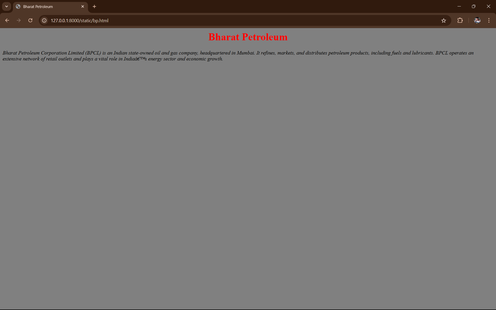
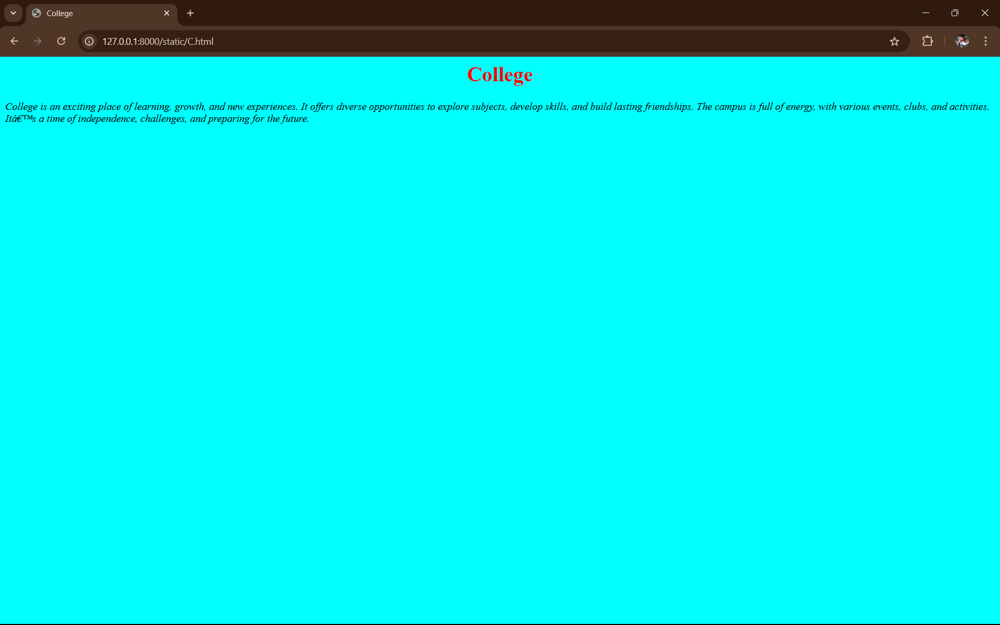
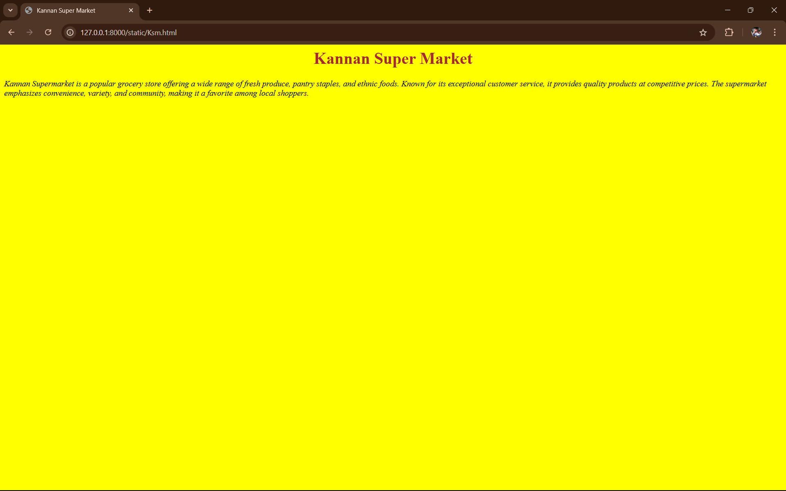

# Ex04 Places Around Me
## Date: 22.11.2024

## AIM
To develop a website to display details about the places around my house.

## DESIGN STEPS

### STEP 1
Create a Django admin interface.

### STEP 2
Download your city map from Google.

### STEP 3
Using ```<map>``` tag name the map.

### STEP 4
Create clickable regions in the image using ```<area>``` tag.

### STEP 5
Write HTML programs for all the regions identified.

### STEP 6
Execute the programs and publish them.

## CODE
```

MyCity.html

<html>
<head>
    <title>My City</title>
</head>
<body> 
    <h1 align="center"><font color="Red"><b>Kanchepuram</b></font></h1>
    <h3 align="center"><font color="blue"><b>Kishore B (24900596)</b></font></h3>
    <center>
        
        <map name="MyCity">
            <area target="" alt="Kannan Super Market" title="Kannan Super Market" href="Ksm.html" coords="423,256,577,290" shape="rect">
            <area target="" alt="Bharat Petroleum" title="Bharat Petroleum" href="bp.html" coords="842,307,969,344" shape="rect">
            <area target="" alt="College" title="College" href="C.html" coords="7,418,153,473" shape="rect">
            <area target="" alt="My Home" title="My Home" href="Mh.html" coords="984,110,27" shape="circle">
            <area target="" alt="School" title="School" href="S.html" coords="193,292,225,228" shape="rect">
        </map>
    </center>
</body>
</html>

Bp.html

<html>
<head>
<title>Bharat Petroleum</title>
</head>
<body bgcolor="grey">
    <h1 align="center"><font color="Red"><b>Bharat Petroleum</b></font></h1>
    <p ><i>Bharat Petroleum Corporation Limited (BPCL) is an Indian state-owned oil and gas company, headquartered in Mumbai. It refines, markets, and distributes petroleum products, including fuels and lubricants. BPCL operates an extensive network of retail outlets and plays a vital role in India’s energy sector and economic growth.
    </i>
    </p>
</body>
</html>

Ksm.html

<html>
<head>
<title>Kannan Super Market</title>
</head>
<body bgcolor="Yellow">
    <h1 align="center"><font color="brown"><b>Kannan Super Market</b></font></h1>
    <p ><i>Kannan Supermarket is a popular grocery store offering a wide range of fresh produce, pantry staples, and ethnic foods. Known for its exceptional customer service, it provides quality products at competitive prices. The supermarket emphasizes convenience, variety, and community, making it a favorite among local shoppers.
    </i>
    </p>
</body>
</html>

Mh.html

<html>
<head>
<title>My Home</title>
</head>
<body bgcolor="violet">
    <h1 align="center"><font color="Blue"><b>My Home</b></font></h1>
    <p ><i>My home is a cozy, welcoming place filled with warmth and comfort. It features a blend of modern and traditional decor, creating a peaceful atmosphere. Every corner holds memories of family moments and laughter. It's a sanctuary where I can relax, unwind, and feel truly at ease.
    </i>
    </p>
</body>
</html>

C.html

<html>
<head>
<title>College</title>
</head>
<body bgcolor="cyan">
    <h1 align="center"><font color="red"><b>College</b></font></h1>
    <p ><i>College is an exciting place of learning, growth, and new experiences. It offers diverse opportunities to explore subjects, develop skills, and build lasting friendships. The campus is full of energy, with various events, clubs, and activities. It’s a time of independence, challenges, and preparing for the future.
    </i>
    </p>
</body>
</html>

S.html

<html>
<head>
<title>School</title>
</head>
<body bgcolor="orange">
    <h1 align="center"><font color="green"><b>School</b></font></h1>
    <p ><i>School is a place of learning, discovery, and personal growth. It provides students with essential knowledge, skills, and opportunities to explore their interests. Through lessons, activities, and interactions with teachers and peers, school fosters creativity, critical thinking, and social development, shaping students for their future endeavors.
    </i>
    </p>
</body>
</html>
```

## OUTPUT






## RESULT
The program for implementing image maps using HTML is executed successfully.
